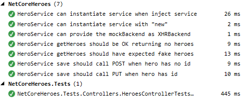

# NetCoreHeroes

> This example is now configured for **webpack**, the latest commit targeting **system.js** can be found at commit [def228f](https://github.com/GeorgDangl/NetCoreHeroes/tree/cdb988aa40c7ce3dfd019cc8ada199bb7665852b)

> This project is using the Visual Studio 2017 *.csproj format. The latest version that works with Visual Studio 2015 can be found at commit [9a5591c](https://github.com/GeorgDangl/NetCoreHeroes/commit/9a5591c810a0cfe87bb79ddf09dca42b3e96803e)

NetCoreHeroes is an example project for the [Angular 2 Tour of Heroes tutorial](https://angular.io/docs/ts/latest/quickstart.html) using
TypeScript in Visual Studio 2015. It's currently on Angular 4.1.3 and Asp.Net Core 1.1.2.
I've [published a few blog posts](https://blog.dangl.me/archive/netcoreheroes-angular2-with-net-core-in-visual-studio-2015-part-i/) describing the process from setting up Visual Studio to Continuous Integration with Jenkins.

**A live example is [available here](https://netcoreheroes.dangl.me).**

## Build and run the project

**Visual Studio**: Restore node packages for the main `NetCoreHeroes` project and hit F5 to launch in debug mode.

**Command Line**: Run `npm install`, then `npm run tsc` to restore client side dependencies and compile TypeScript.
`npm run webpack` creates the client side JavaScript bundles. You might use the [WebPack Task Runner](https://marketplace.visualstudio.com/items?itemName=MadsKristensen.WebPackTaskRunner)
in Visual Studio to automatically regenerate the client side bundles when you debug the solution.

Then run `dotnet restore` and `dotnet build` to compile the Asp.Net Core backend. `dotnet run` starts the project.

## Run unit tests

### Asp.Net Core Tests

Just build the whole solution, the `NetCoreHeroes.Tests` project has the required xUnit dependencies so unit tests are automatically
discovered in Visual Studio.

### TypeScript Tests

To run the unit tests for Angular 2 components, get the
[Chutzpah Test Adapter for Visual Studio](https://visualstudiogallery.msdn.microsoft.com/f8741f04-bae4-4900-81c7-7c9bfb9ed1fe).
The Angular 2 tests should then be available in the Visual Studio Test Explorer after a rebuild.

This example includes tests using `async` and `inject` with a `MockBackend` to unit test the `HeroService`.